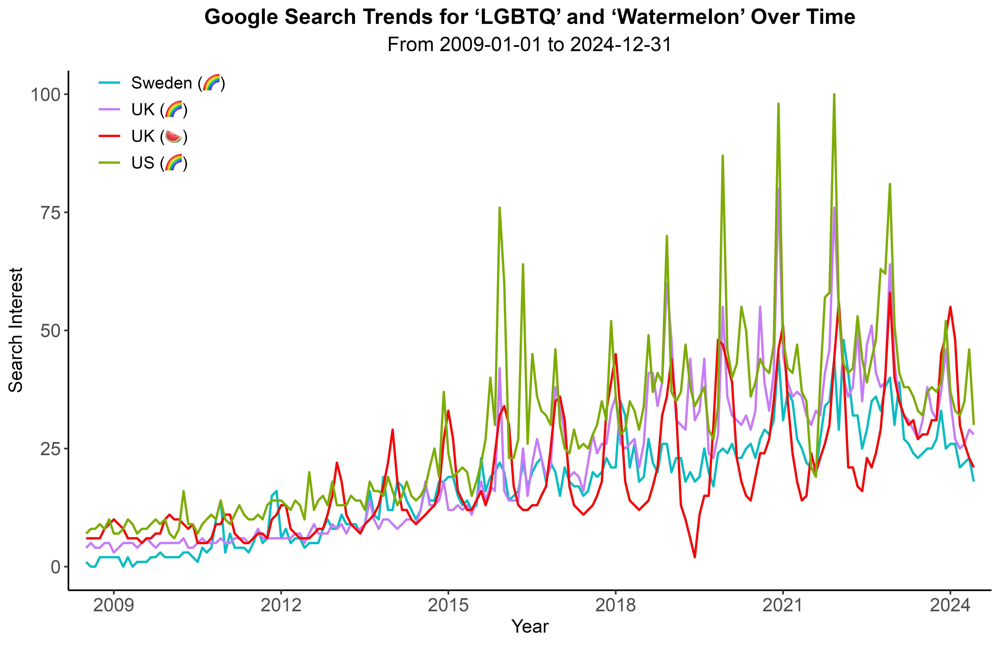

  

<em>Search interest is measured relative to the highest point on the chart for the given region and time. A value of 100 is the peak popularity for the term. A value of 50 means that the term is half as popular. Source: [Google Trends](https://trends.google.com/trends/explore?date=2009-01-01%202024-12-31,2009-01-01%202024-12-31,2009-01-01%202024-12-31,2009-01-01%202024-12-31&geo=GB,SE,US,GB&q=%2Fm%2F0hn10,%2Fm%2F0hn10,%2Fm%2F0hn10,%2Fm%2F0kpqd&hl=en-GB). License: MIT License.</em>

