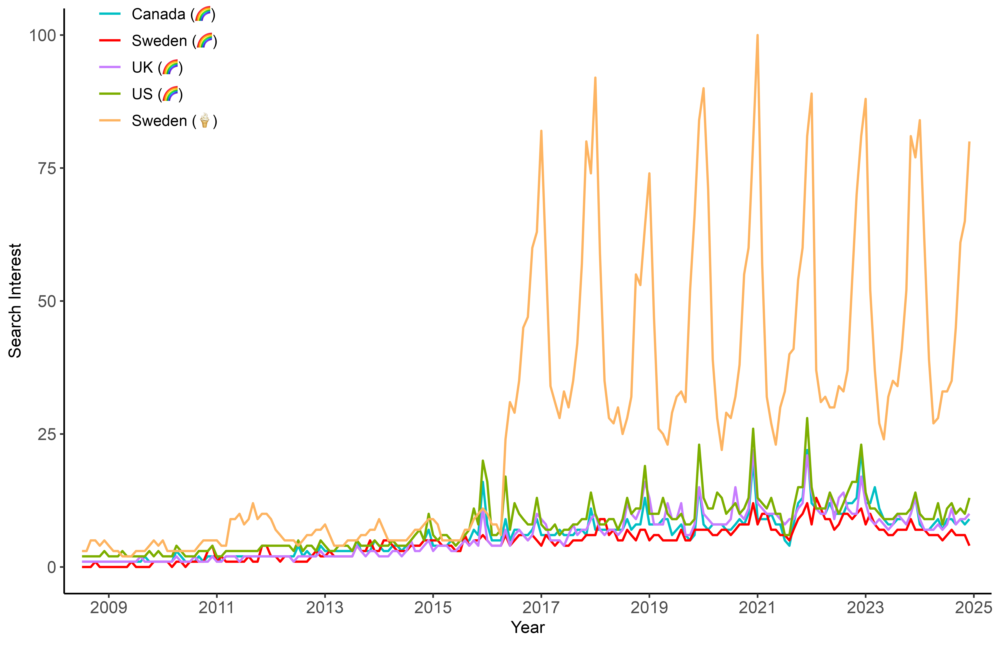
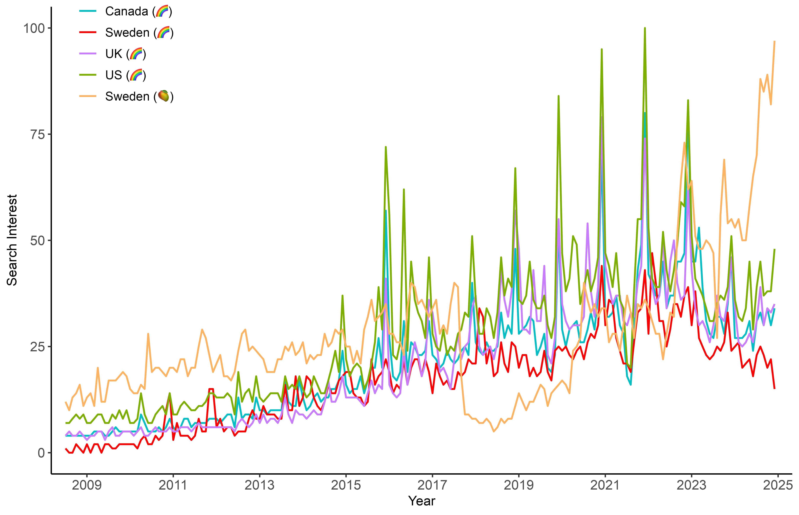

**Google Search Trends for the Topic 'LGBTQ', from January 1, 2009 to March 31, 2025** 
Search interest is measured relative to the highest point on the chart for the given region and time. A value of 100 is the peak popularity for the term. A value of 50 means that the term is half as popular. The search interest for LGBTQ topics is also compared to ice cream, mango, and watermelon, to illustrate relative interest and seasonal trends. Source: [Google Trends](https://trends.google.com/trends/explore?date=2009-01-01%202025-03-31,2009-01-01%202025-03-31,2009-01-01%202025-03-31,2009-01-01%202025-03-31,2009-01-01%202025-03-31&geo=GB,SE,US,GB,CA&q=%2Fm%2F0hn10,%2Fm%2F0hn10,%2Fm%2F0hn10,%2Fm%2F0kpqd,%2Fm%2F0hn10&hl=en-GB). License: MIT License.
  

  

  

  
